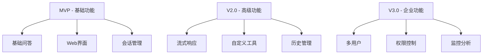
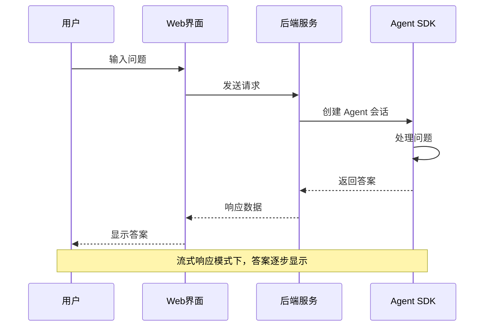

# AI 问答助手 - 产品需求文档 (PRD)

**版本**: 1.0  
**创建日期**: 2026-01-28  
**负责人**: 产品团队  
**状态**: 规划中

---

## 一、产品背景与目标

### 1.1 产品背景

随着 AI 技术的快速发展，企业和个人都需要一个便捷、可靠的 AI 问答系统来提升工作效率。传统的 AI 对话工具存在以下问题：

- **依赖第三方平台**：必须通过网页或特定应用访问
- **数据隐私顾虑**：对话数据存储在第三方服务器
- **定制化困难**：无法根据业务需求深度定制
- **集成成本高**：难以集成到现有业务系统

### 1.2 产品愿景

构建一个**基于 Claude Agent SDK 的生产级 AI 问答系统**，提供：

- 🚀 **易部署**：快速部署到本地或云端
- 🔒 **数据安全**：完全控制数据流向
- 🎯 **高度定制**：可扩展工具和功能
- 💼 **生产就绪**：稳定可靠，适合企业使用

### 1.3 核心目标

| 目标类型 | 具体指标 |
|---------|---------|
| **用户体验** | 响应时间 < 3秒，界面简洁美观 |
| **技术指标** | 99%+ 可用性，支持并发会话 |
| **业务价值** | 提升工作效率 30%+ |

---

## 二、目标用户

### 2.1 用户画像

**主要用户群体**：

1. **技术开发者**
   - 需要快速获取技术答案
   - 需要代码示例和最佳实践
   - 希望本地部署保护代码隐私

2. **企业团队**
   - 需要部署内部知识问答系统
   - 需要与现有业务系统集成
   - 重视数据安全和合规性

3. **个人用户**
   - 学习编程或新技术
   - 日常问题咨询
   - 希望拥有个人 AI 助手

### 2.2 用户需求分析

| 用户类型 | 核心需求 | 痛点 |
|---------|---------|------|
| 技术开发者 | 快速获取准确答案 | 网页版太慢，无法离线使用 |
| 企业团队 | 数据安全、可定制 | 第三方服务数据泄露风险 |
| 个人用户 | 简单易用、免费 | 商业服务成本高 |

---

## 三、产品功能

### 3.1 核心功能（MVP）

#### 3.1.1 基础问答功能

- **功能描述**：用户输入问题，AI 返回答案
- **技术实现**：基于 Claude Agent SDK
- **用户价值**：快速获取准确答案

#### 3.1.2 实时对话界面

- **功能描述**：现代化 Web 聊天界面
- **关键特性**：
  - 消息气泡显示
  - 打字动画效果
  - 历史对话记录
  - 响应式设计（支持移动端）

#### 3.1.3 会话管理

- **功能描述**：支持多轮对话，保持上下文
- **技术实现**：利用 Agent SDK 的会话管理能力
- **用户价值**：连贯的对话体验

### 3.2 高级功能（V2.0）

#### 3.2.1 流式响应

- **功能描述**：AI 答案逐字显示
- **用户价值**：减少等待感，提升体验

#### 3.2.2 自定义工具集成

- **功能描述**：扩展 Agent 的工具能力
- **示例工具**：
  - 搜索网页
  - 查询数据库
  - 执行代码
  - 读写文件

#### 3.2.3 对话历史管理

- **功能描述**：保存和检索历史对话
- **技术方案**：本地数据库或云存储

#### 3.2.4 多用户支持

- **功能描述**：支持多用户同时使用
- **技术方案**：会话隔离机制

### 3.3 功能优先级



---

## 四、产品架构

### 4.1 技术架构

```mermaid
graph LR
    A[用户浏览器] -->|HTTP/WebSocket| B[Web服务器]
    B -->|SDK Session| C[Claude Agent SDK]
    C -->|Local Process| D[Claude CLI]
    D -->|HTTPS| E[External API (OpenAI/Anthropic Compatible)]
    
    style C fill:#667eea,color:#fff
    style D fill:#764ba2,color:#fff
```

### 4.2 系统组件

| 组件 | 技术选型 | 说明 |
|-----|---------|------|
| **前端** | HTML + CSS + JavaScript | 轻量级，无需构建 |
| **后端** | Node.js + Express | 成熟稳定的 Web 框架 |
| **AI引擎** | Claude Agent SDK + Local CLI | **关键架构**：通过本地 CLI 进程实现更强的环境控制能力 |
| **API适配** | Env Config | 支持 OpenAI/Anthropic 兼容的第三方 API |
| **数据存储** | SQLite / JSON 文件 | 轻量级本地存储 |

### 4.3 为什么选择 Claude Agent SDK？

> [!IMPORTANT]  
> **Claude Agent SDK vs 普通 API SDK 对比**

| 对比维度 | Claude Agent SDK | 普通 API SDK |
|---------|-----------------|-------------|
| **工具执行** | ✅ 自动处理工具调用循环 | ❌ 需要手动实现 |
| **会话管理** | ✅ 内置会话状态管理 | ❌ 需要手动维护 |
| **上下文处理** | ✅ 自动管理上下文窗口 | ❌ 需要手动截断 |
| **生产就绪** | ✅ 2026年1月正式发布 | ⚠️ 需要额外封装 |
| **适用场景** | 🎯 复杂 Agent 应用 | 📝 简单问答 |

**结论**：Claude Agent SDK 是构建生产级 AI Agent 的最佳选择。

---

## 五、用户体验设计

### 5.1 界面设计原则

1. **简洁优先**：去除不必要的元素，聚焦核心功能
2. **即时反馈**：每个操作都有明确的视觉反馈
3. **渐进式披露**：高级功能通过二级菜单访问
4. **美观现代**：使用渐变色、圆角、阴影等现代设计元素

### 5.2 交互流程



### 5.3 关键页面设计要求

#### 主界面

- **顶部**：品牌 Logo + 标题
- **中间**：聊天对话区域（可滚动）
- **底部**：输入框 + 发送按钮
- **辅助**：示例问题、设置按钮

#### 视觉规范

- **主色调**：紫色渐变 (#667eea → #764ba2)
- **背景色**：白色/浅灰色
- **字体**：系统默认字体（中文：苹方/微软雅黑）
- **圆角**：统一使用 20px
- **间距**：遵循 8px 基准网格

---

## 六、成功指标

### 6.1 技术指标

| 指标 | 目标值 | 测量方法 |
|-----|-------|---------|
| 响应时间 | < 3秒 | 后端监控 |
| 可用性 | 99%+ | 服务监控 |
| 并发支持 | 10+ 会话 | 压力测试 |
| 错误率 | < 1% | 日志分析 |

### 6.2 用户体验指标

| 指标 | 目标值 | 测量方法 |
|-----|-------|---------|
| 用户满意度 | 4.5+/5.0 | 用户调研 |
| 任务完成率 | 90%+ | 用户测试 |
| 学习曲线 | < 5分钟上手 | 新用户测试 |

### 6.3 业务指标

- **部署成功率**：95%+ 的用户能成功部署
- **使用频率**：活跃用户日均使用 3+ 次
- **推荐意愿**：NPS > 50

---

## 七、风险与限制

### 7.1 技术风险

| 风险 | 影响 | 缓解措施 |
|-----|------|---------|
| API 调用失败 | 高 | 实现重试机制 + 错误提示 |
| 响应时间过长 | 中 | 添加超时和取消功能 |
| 并发问题 | 中 | 会话队列管理 |

### 7.2 成本限制

- **API 成本**：需要 Anthropic API Key（付费）
- **服务器成本**：云端部署需要服务器费用
- **解决方案**：提供本地部署选项，用户自行承担 API 费用

### 7.3 合规要求

> [!WARNING]  
> **重要合规事项**
> 
> - 遵守 Anthropic 商业使用条款
> - 不得用于非法用途
> - 保护用户隐私数据
> - 明确告知用户 AI 的使用

---

## 八、开发计划

### 8.1 里程碑

| 阶段 | 时间 | 交付物 |
|-----|------|--------|
| **需求设计** | Week 1 | PRD + 技术方案 |
| **MVP 开发** | Week 2-3 | 基础功能上线 |
| **测试优化** | Week 4 | 稳定版本 |
| **V2.0 开发** | Week 5-6 | 高级功能 |

### 8.2 验收标准

**MVP 版本验收**：
- ✅ 用户可以成功提问并获得答案
- ✅ 界面美观，响应流畅
- ✅ 支持多轮对话
- ✅ 错误处理完善
- ✅ 部署文档完整

---

## 九、附录

### 9.1 参考资料

- [Claude Agent SDK 官方文档](https://docs.anthropic.com/claude/docs/agent-sdk)
- [Anthropic API 文档](https://docs.anthropic.com)
- [Node.js 最佳实践](https://github.com/goldbergyoni/nodebestpractices)

### 9.2 术语表

| 术语 | 解释 |
|-----|------|
| **Agent** | 能够自主执行任务的 AI 系统 |
| **SDK** | Software Development Kit，软件开发工具包 |
| **会话** | 一次完整的对话过程 |
| **工具调用** | Agent 调用外部功能的能力 |
| **流式响应** | 答案逐步返回而非一次性返回 |

---

**文档版本历史**：
- v1.0 (2026-01-28): 初始版本
