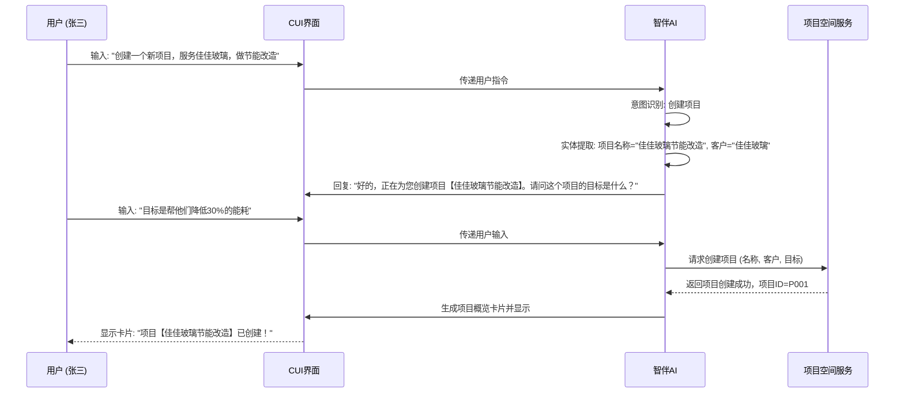
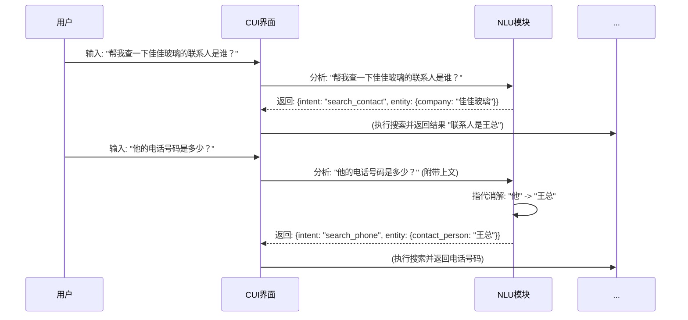
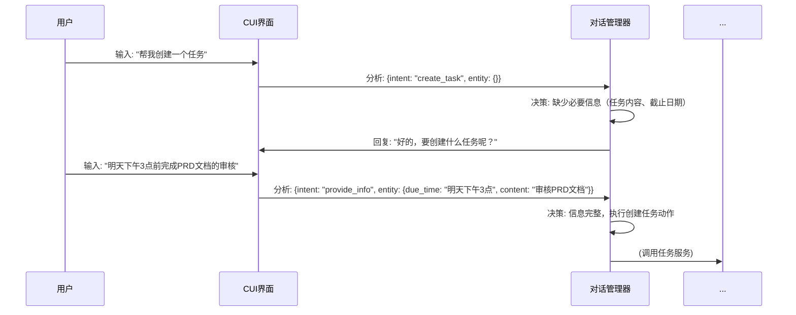

# 企业级AI原生协同平台 产品需求文档 (PRD) - V2.0

**文档状态**: 撰写中  
**版本**: 2.0.4  
**日期**: 2026年1月26日  
**撰写人**: Manus AI

---

## 第四部分：平台1功能详细设计

平台1是业务执行用户（客户代表、解决方案专家等）的核心工作界面。本部分将详细阐述平台1的每一个功能模块，提供可供开发团队直接参考的详细设计方案。设计遵循CUI（对话式界面）为主，GUI（图形化界面）为辅的原则，旨在提供流畅、智能、高效的用户体验。

### 4.1. 项目空间 (Project Space)

项目空间是平台1中组织工作的基本单位。每个项目空间对应一个具体的业务实践，如“为佳佳玻璃提供节能改造方案”。它是一个独立的、持久化的多媒体工作容器，汇集了该项目相关的所有人员、对话、任务、文件和工具。

#### 4.1.1. 功能：项目创建

**1. 功能说明**

允许用户创建一个新的项目空间，作为启动一项新业务的起点。

**2. 用户故事**

- **作为一名客户代表**，我想要**通过一句话快速创建一个新项目**，以便在我发现一个新的业务机会时，能立即开始工作和记录。
- **作为一名项目经理**，我想要**在创建项目时，能够关联客户、设置项目目标和截止日期**，以便从一开始就对项目进行规范化管理。

**3. 功能清单**

| 编号 | 功能点 | 优先级 |
| :--- | :--- | :--- |
| 4.1.1.1 | 通过CUI指令创建项目 | P0 |
| 4.1.1.2 | 通过GUI表单创建项目 | P0 |
| 4.1.1.3 | 创建时关联核心信息（客户、项目名称、目标） | P0 |
| 4.1.1.4 | 自动初始化项目模板 | P1 |
| 4.1.1.5 | 创建后自动生成项目概览卡片 | P0 |

**4. 交互流程**

**流程1：CUI快速创建**



**流程2：GUI表单创建**

- 用户点击左侧导航栏的“+”号或“创建项目”按钮。
- 弹出项目创建模态框，包含以下字段：
  - 项目名称（必填）
  - 关联客户（可选，可从CRM或本体库中搜索）
  - 项目目标（可选，文本域）
  - 项目描述（可选，富文本编辑器）
  - 项目成员（可选，默认为创建者）
  - 截止日期（可选，日期选择器）
  - 选择项目模板（可选，默认为“标准业务项目”）
- 用户填写完毕后，点击“创建”按钮，系统执行后台创建流程，成功后跳转至新的项目空间。

**5. 界面设计 (原型描述)**

- **CUI界面**: 对话流中，系统返回的项目概览卡片应包含：
  - **标题**: 项目名称
  - **核心信息**: 客户、创建人、创建时间、目标
  - **快捷操作按钮**: “邀请成员”、“新建任务”、“上传文件”
- **GUI模态框**: 标准的表单弹窗设计，布局清晰，必填项有星号标识，提供良好的输入提示和校验反馈。

**6. 数据结构**

**Project (项目) 数据表**

| 字段名 | 数据类型 | 描述 | 示例 |
| :--- | :--- | :--- | :--- |
| `project_id` | String | 唯一标识符 (主键) | `proj_absd1234` |
| `name` | String | 项目名称 | "佳佳玻璃节能改造" |
| `goal` | Text | 项目目标 | "帮他们降低30%的能耗" |
| `description` | Text | 项目详细描述 | ... |
| `customer_id` | String | 关联的客户ID | `cust_9876` |
| `status` | Enum | 项目状态 | `OPEN`, `IN_PROGRESS`, `CLOSED` |
| `creator_id` | String | 创建者用户ID | `user_zhangsan` |
| `due_date` | Timestamp | 截止日期 | `2026-12-31 23:59:59` |
| `created_at` | Timestamp | 创建时间 | `2026-01-26 10:00:00` |
| `updated_at` | Timestamp | 最后更新时间 | `2026-01-26 10:00:00` |

**7. 接口定义 (API)**

`POST /api/v1/projects`

- **功能**: 创建一个新项目
- **请求体 (Request Body)**:
  ```json
  {
    "name": "佳佳玻璃节能改造",
    "goal": "帮他们降低30%的能耗",
    "customer_id": "cust_9876",
    "member_ids": ["user_zhangsan"],
    "template_id": "tpl_standard_biz"
  }
  ```
- **成功响应 (Success Response)**: `201 Created`
  ```json
  {
    "project_id": "proj_absd1234",
    "name": "佳佳玻璃节能改造",
    "status": "OPEN",
    "created_at": "2026-01-26T10:00:00Z"
  }
  ```

**8. 技术实现说明**

- 项目创建时，需在后台同时初始化项目的默认目录结构（如`/docs`, `/data`, `/tasks`），并为项目创建一个专属的频道或Topic用于消息同步。
- 若选择项目模板，则需将模板中预设的任务、文档等一并复制到新项目中。

**9. 异常处理**

- **CUI创建**: 如果AI无法从用户输入中提取到项目名称，应主动询问：“好的，要创建一个新项目。请问项目名称是什么？”
- **GUI创建**: 如果必填项“项目名称”未填写，点击“创建”时按钮置灰，并在输入框下方提示“请输入项目名称”。
- **权限**: 如果用户没有创建项目的权限，应明确提示“抱歉，您没有创建项目的权限”。

---

#### 4.1.2. 功能：项目管理

**1. 功能说明**

提供对已创建项目的查看、编辑、归档和删除等管理功能。

**2. 用户故事**

- **作为一名用户**，我想要**在一个地方看到我参与的所有项目列表**，以便**快速切换和查找**。
- **作为一名项目经理**，我想要**能够修改项目的基本信息（如目标、截止日期）**，以便**在项目进展中进行调整**。
- **作为一名项目经理**，我想要**在项目结束后将其归档**，以便**保持项目列表的整洁，同时保留历史数据以备查阅**。

**3. 功能清单**

| 编号 | 功能点 | 优先级 |
| :--- | :--- | :--- |
| 4.1.2.1 | 项目列表展示（我参与的、我创建的、已归档的） | P0 |
| 4.1.2.2 | 项目搜索与筛选 | P1 |
| 4.1.2.3 | 编辑项目基本信息 | P0 |
| 4.1.2.4 | 归档项目 | P0 |
| 4.1.2.5 | 恢复已归档项目 | P1 |
| 4.1.2.6 | 删除项目（软删除） | P2 |

**4. 交互流程**

- **项目列表**: 平台1左侧导航栏有“项目”入口，点击后进入项目中心页面。
- **页面布局**: 左侧为筛选器（按状态、按角色），右侧为项目卡片列表。
- **项目卡片**: 每个卡片显示项目名称、客户、进度（基于任务完成度）、核心成员头像。
- **操作**: 鼠标悬浮在卡片上时，显示“进入”、“设置”、“归档”等操作按钮。
- **编辑**: 点击“设置”，弹出与创建项目类似的GUI表单，允许修改项目信息。
- **归档**: 点击“归档”，弹出二次确认框：“确定要归档项目【佳佳玻璃节能改造】吗？归档后项目将变为只读状态。”

**5. 界面设计 (原型描述)**

- **项目中心**: 采用看板或列表视图，提供清晰的视觉引导。
- **筛选器**: 位于页面顶部或左侧，提供多维度筛选和关键词搜索功能。
- **项目设置**: 独立的页面或Tab，包含“基本信息”、“成员管理”、“权限设置”、“通知设置”等子模块。

**6. 数据结构**

- 在`Project`表中增加`is_archived` (Boolean) 和 `is_deleted` (Boolean) 字段。

**7. 接口定义 (API)**

- `GET /api/v1/projects`: 获取项目列表，支持参数筛选（如 `?user_id=...`, `?status=...`）。
- `PUT /api/v1/projects/{project_id}`: 更新项目信息。
- `POST /api/v1/projects/{project_id}/archive`: 归档项目。
- `DELETE /api/v1/projects/{project_id}`: 删除项目。

**8. 技术实现说明**

- 归档操作应将项目及其所有关联内容（任务、文件、对话）设置为只读状态。
- 删除操作建议为软删除，数据在后台保留一段时间（如30天），以防误操作。

**9. 异常处理**

- 只有项目管理员或特定角色的用户才能执行编辑、归档、删除等操作，无权限用户操作时应明确提示。
- 归档或删除正在进行中的重要任务的项目时，应给出强提醒。

---

**（第四部分部分内容）**


### 4.2. CUI引擎 (Conversational UI Engine)

CUI引擎是平台1的核心交互中枢，负责理解用户的自然语言指令，并以最合适的方式进行响应。它不仅仅是一个聊天机器人，更是一个能够理解复杂意图、调用工具、并以丰富形式呈现结果的智能交互系统。

#### 4.2.1. 功能：自然语言理解 (NLU)

**1. 功能说明**

准确地从用户的输入中识别其意图（Intent）和关键信息（Entities）。

**2. 用户故事**

- **作为一名用户**，我希望**我可以用大白话和系统交流**，而不是学习复杂的指令，以便**降低我的使用门槛**。
- **作为一名用户**，我希望**即使我的表达有些模糊或有错别字，系统也能大概理解我的意思**，以便**提升交互的容错性**。

**3. 功能清单**

| 编号 | 功能点 | 优先级 |
| :--- | :--- | :--- |
| 4.2.1.1 | 核心意图识别（如：创建任务、搜索文件、提问） | P0 |
| 4.2.1.2 | 通用实体提取（如：时间、人名、客户名） | P0 |
| 4.2.1.3 | 领域特定实体提取（如：产品型号、合同编号） | P1 |
| 4.2.1.4 | 多意图识别与澄清 | P1 |
| 4.2.1.5 | 上下文理解与指代消解 | P0 |
| 4.2.1.6 | 错别字纠正与模糊匹配 | P1 |

**4. 交互流程**

**场景：指代消解**



**5. 技术实现说明**

- NLU模块基于大语言模型（LLM）实现，通过精心设计的Prompt来完成意图和实体的提取。
- 针对高频或需要高精度的领域特定实体，可以结合传统的CRF（条件随机场）或正则匹配进行增强。
- 需维护一个动态的实体词典，该词典可从本体数据底座中自动同步（如客户列表、项目名称列表）。

---

#### 4.2.2. 功能：对话管理 (DM)

**1. 功能说明**

负责维护对话状态，根据NLU的理解结果和当前上下文，决定下一步系统应该执行什么动作（如回答问题、调用工具、反问澄清）。

**2. 用户故事**

- **作为一名用户**，我希望**在我连续提问时，系统能够记住我们正在讨论的话题**，而不是每次都要重复背景信息。
- **作为一名用户**，我希望**当我的指令不清晰时，系统能主动询问我，引导我完成操作**，而不是直接报错或不响应。

**3. 功能清单**

| 编号 | 功能点 | 优先级 |
| :--- | :--- | :--- |
| 4.2.2.1 | 单轮对话处理 | P0 |
| 4.2.2.2 | 多轮对话状态跟踪 | P0 |
| 4.2.2.3 | 澄清与追问策略 | P0 |
| 4.2.2.4 | 任务型对话流（如订票、请假） | P1 |
| 4.2.2.5 | 对话中断与恢复 | P2 |

**4. 交互流程**

**场景：澄清与追问**



**5. 技术实现说明**

- 对话管理可以采用基于规则的状态机模型处理简单的任务型对话。
- 对于复杂的开放式对话，则依赖LLM的上下文理解和生成能力来驱动对话流程。
- 需设计一套“动作（Action）”集合，DM的输出就是一个具体的动作，如`action_answer_question`, `action_call_tool`, `action_ask_clarification`。

---

#### 4.2.3. 功能：多模态输出

**1. 功能说明**

不仅仅是返回文本，而是根据内容和场景，以最合适的富媒体形式（如卡片、图表、按钮）向用户呈现信息和操作选项。

**2. 用户故事**

- **作为一名用户**，我希望**当我搜索一个项目时，返回的是一个清晰的项目卡片**，而不是一大段文字描述，以便**我能快速获取核心信息**。
- **作为一名用户**，我希望**当系统需要我做选择时，能直接提供按钮让我点击**，而不是让我手动输入选项，以便**提升操作效率**。

**3. 功能清单**

| 编号 | 功能点 | 优先级 |
| :--- | :--- | :--- |
| 4.2.3.1 | 基础文本与Markdown渲染 | P0 |
| 4.2.3.2 | 交互式卡片（如项目卡、任务卡） | P0 |
| 4.2.3.3 | 快捷操作按钮 | P0 |
| 4.2.3.4 | 数据图表渲染（如柱状图、饼图） | P1 |
| 4.2.3.5 | 嵌入式GUI工具（如文档、白板） | P0 |

**4. 界面设计 (原型描述)**

- **卡片设计**: 遵循统一的视觉规范，信息分区清晰。例如，一个任务卡片应包含：
  - 任务标题
  - 状态标签（进行中/已完成）
  - 负责人头像
  - 截止日期
  - 快捷操作（标记完成、添加评论）
- **图表渲染**: 集成轻量级的图表库（如ECharts, Chart.js），支持在对话流中直接渲染后端返回的图表数据。

**5. 技术实现说明**

- 前端需实现一个卡片渲染引擎，能够根据后端返回的JSON数据动态生成不同类型的卡片。
- 后端（或LLM）在生成响应时，需遵循预定义的JSON格式来描述卡片、按钮或图表的内容和结构。

---

### 4.3. GUI工作台 (Graphical UI Workbench)

GUI工作台是CUI能力的延伸和补充，为需要深度编辑、复杂协作和结构化呈现的场景提供图形化操作界面。它不是一个独立的工具集，而是与CUI深度融合的工作区域。

#### 4.3.1. 功能：文档编辑器

**1. 功能说明**

提供一个支持富文本编辑和多人实时协同的在线文档工具，用于沉淀项目的正式交付物，如报告、方案、纪要等。

**2. 用户故事**

- **作为一名解决方案专家**，我想要**让AI伙伴将我们的讨论内容，直接生成一份方案初稿到文档里**，以便**我可以在此基础上进行修改和完善**。
- **作为一名项目经理**，我想要**和团队成员同时编辑一份文档，并看到对方的光标和修改**，以便**进行高效的在线协作**。

**3. 功能清单**

| 编号 | 功能点 | 优先级 |
| :--- | :--- | :--- |
| 4.3.1.1 | 富文本编辑（标题、加粗、列表、表格、图片） | P0 |
| 4.3.1.2 | 多人实时协同编辑 | P0 |
| 4.3.1.3 | CUI内容一键转存至文档 | P0 |
| 4.3.1.4 | 评论与批注功能 | P1 |
| 4.3.1.5 | 版本历史与追溯 | P1 |
| 4.3.1.6 | 文档模板库 | P1 |
| 4.3.1.7 | 导出为PDF/Word | P2 |

**4. 交互流程**

**场景：CUI内容转存**

- 在CUI对话流中，AI生成了一段较长的分析报告。
- 在该消息卡片的右上角，提供一个“存为文档”的按钮。
- 用户点击按钮，系统弹出对话框：“请选择要存入的文档，或新建文档”。
- 用户选择或新建后，系统将该消息内容追加或创建到指定的文档中，并返回一个文档链接卡片。

**5. 技术实现说明**

- 可基于成熟的开源协同编辑器进行二次开发，如TipTap, Slate.js, 或Etherpad。
- 需实现CUI与GUI之间的状态同步，例如，在文档中@一个同事，对方应能在CUI中收到通知。

---

#### 4.3.2. 功能：电子白板

**1. 功能说明**

提供一个无限画布的在线白板，用于团队进行头脑风暴、流程梳理、架构设计等可视化协作。

**2. 用户故事**

- **作为一名产品经理**，我想要**在白板上绘制用户旅程图，并和团队一起贴便签、连线、讨论**，以便**更直观地进行产品设计**。
- **作为一名技术专家**，我想要**让AI伙伴将我描述的系统架构，自动在白板上生成架构图**，以便**快速启动技术评审**。

**3. 功能清单**

| 编号 | 功能点 | 优先级 |
| :--- | :--- | :--- |
| 4.3.2.1 | 基础绘图工具（画笔、形状、文本、箭头） | P0 |
| 4.3.2.2 | 便签贴功能 | P0 |
| 4.3.2.3 | 多人实时协作（光标、视图同步） | P0 |
| 4.3.2.4 | AI生成图表（流程图、架构图） | P1 |
| 4.3.2.5 | 模板库（如SWOT分析、用户旅程图） | P2 |

**4. 技术实现说明**

- 可基于优秀的开源白板库进行开发，如Excalidraw, tldraw。
- AI生成图表功能，可通过集成Mermaid.js或类似库实现，由AI生成图表的文本描述，前端进行渲染。

---

**（第四部分部分内容）**


### 4.4. 智伴AI模块 (Companion AI Module)

智伴AI模块是平台1的“灵魂”，它赋予了产品主动性、智能性和个性化。它不是一个被动等待指令的工具，而是一个能够主动观察、思考、建议，并与用户共同成长的“数字伙伴”。

#### 4.4.1. 功能：主动性引擎

**1. 功能说明**

在不打扰用户核心任务流的前提下，智能地、适时地提供建议、提醒和引导。

**2. 用户故事**

- **作为一名新手客户代表**，我希望**在我进行需求洞察时，智伴能主动提示我标准的业务流程和关键步骤**，以便**我能快速上手，避免遗漏**。
- **作为一名解决方案专家**，我希望**在我撰写方案时，智伴能主动发现我可能忽略的风险点**，以便**提升方案的健壮性**。
- **作为一名项目经理**，我希望**在多人讨论偏离主题时，智伴能适时地将我们拉回正轨**，以便**保证会议效率**。

**3. 功能清单**

| 编号 | 功能点 | 优先级 |
| :--- | :--- | :--- |
| 4.4.1.1 | 基于业务流程的主动引导 | P0 |
| 4.4.1.2 | 基于上下文的风险/机会提醒 | P1 |
| 4.4.1.3 | 用户行为洞察与建议（如长时间无操作） | P1 |
| 4.4.1.4 | 多人协作中的讨论引导与总结 | P2 |
| 4.4.1.5 | 分级提醒机制（CUI直接回复、浮窗提示、角标提醒） | P0 |
| 4.4.1.6 | 用户可配置的主动性等级（安静/标准/积极） | P1 |

**4. 交互流程**

**场景：分级提醒机制**

- **场景A：1对1对话 (直接回复)**
  - 用户张三对智伴说：“帮我分析下佳佳玻璃”。
  - 智伴直接在CUI中回复：“好的，正在分析... 这是佳佳玻璃的基本信息摘要...”。
- **场景B：多人协作，未@智伴 (浮窗提示)**
  - 张三和李四正在讨论方案，张三说：“这个技术方案成本好像有点高。”
  - 智伴检测到“成本高”这一风险关键词，此时**不会直接在CUI中插话**。
  - 而是在CUI窗口的右下角弹出一个**非侵入式浮窗**：“💡 我发现了一个关于成本的讨论，需要我调用历史项目的成本数据进行对比分析吗？” 浮窗包含“好的”和“忽略”按钮。
- **场景C：后台任务完成 (角标提醒)**
  - 用户让智伴去联网搜索一份长篇报告。
  - 任务开始后，智伴提示：“报告搜索任务已在后台运行，完成后会通知您。”
  - 5分钟后任务完成，左侧导航栏“通知”图标出现红点角标，用户点击后看到通知：“您委托的报告搜索任务已完成，点击查看。”

**5. 技术实现说明**

- 主动性引擎需要持续监听项目空间中的事件流（新消息、文件修改、任务状态变更等）。
- 引擎内置一套规则库（可由平台2配置），用于匹配触发条件。例如 `IF (message.contains("风险") AND project.type == "解决方案") THEN trigger_risk_reminder`。
- 结合LLM的上下文理解能力，对非结构化的对话内容进行实时分析，以发现更隐性的触发时机。

---

#### 4.4.2. 功能：推荐引擎

**1. 功能说明**

根据当前任务和上下文，从海量的知识库中为用户精准推荐最相关的内容，如历史案例、经验模板、专家或工具。

**2. 用户故事**

- **作为一名客户代表**，我希望**在服务一个新行业的客户时，系统能自动推荐给我公司内部做过类似项目的同事**，以便**我能向他们请教经验**。
- **作为一名解决方案专家**，我希望**在我开始设计一个新方案时，系统能把最相关的3-5个历史方案模板直接推送给我**，以便**我能快速启动工作**。

**3. 功能清单**

| 编号 | 功能点 | 优先级 |
| :--- | :--- | :--- |
| 4.4.2.1 | 推荐相关经验（案例、模板、Skill） | P0 |
| 4.4.2.2 | 推荐相关人员（领域专家） | P1 |
| 4.4.2.3 | 推荐相关工具（MCP服务） | P1 |
| 4.4.2.4 | 推荐结果的个性化排序 | P2 |
| 4.4.2.5 | 用户对推荐结果的反馈机制（有用/没用） | P1 |

**4. 技术实现说明**

- 推荐引擎的核心是“相似度计算”。它将当前任务的上下文（如项目描述、用户输入、客户行业等）向量化。
- 然后在本体数据底座中进行向量检索，找到与当前上下文最相似的经验、人员或工具。
- 推荐算法可以从简单的基于关键词的TF-IDF，逐步演进到基于深度学习的混合推荐模型。
- 用户的反馈数据是优化推荐算法的关键，需闭环收集。

---

### 4.5. 协同模块 (Collaboration Module)

协同模块旨在打破部门墙和信息孤岛，让不同角色的成员能够在一个共享的空间中无缝沟通、高效协作。

#### 4.5.1. 功能：多角色实时协作

**1. 功能说明**

支持多人同时在一个项目空间中进行对话、编辑文档、操作白板，并保证所有人的视图和数据实时同步。

**2. 用户故事**

- **作为一名项目经理**，我想要**能随时将法务、财务等同事拉入项目进行临时讨论**，并且**他们能立刻看到完整的上下文**，以便**快速解决跨部门问题**。
- **作为一名用户**，我想要**在对话中直接@某个同事或@智伴**，以便**明确指定消息的接收者和需要执行操作的对象**。

**3. 功能清单**

| 编号 | 功能点 | 优先级 |
| :--- | :--- | :--- |
| 4.5.1.1 | 项目成员邀请与管理 | P0 |
| 4.5.1.2 | 基于角色的权限控制 (RBAC) | P1 |
| 4.5.1.3 | CUI/GUI内容的实时同步 | P0 |
| 4.5.1.4 | @功能（唤起用户或AI） | P0 |
| 4.5.1.5 | 消息的Thread讨论 | P1 |
| 4.5.1.6 | 全局通知中心 | P0 |

**4. 技术实现说明**

- 实时同步可采用WebSocket或CRDTs（无冲突复制数据类型）技术实现。
- @功能需要在前端的输入框组件中支持，输入“@”后自动弹出项目成员和智伴的列表供选择。
- 后端需根据@信息，向被@的用户推送通知。

---

### 4.6. 记忆模块 (Memory Module)

记忆模块是智伴能够提供个性化、连贯服务的基础。它赋予了智伴“记住”过去的能力。

#### 4.6.1. 功能：分层记忆存储

**1. 功能说明**

将智伴的记忆分为不同层次进行存储和管理，以平衡记忆的广度、深度和调取效率。

**2. 用户故事**

- **作为一名用户**，我希望**智伴能记住我们正在进行的这个项目的全部对话**，以便**我随时可以回顾和查找**。
- **作为一名用户**，我希望**智伴能记住我的个人偏好，比如我习惯让它以“要点总结”的形式回复**，以便**让它更符合我的工作习惯**。

**3. 功能清单**

| 编号 | 功能点 | 优先级 |
| :--- | :--- | :--- |
| 4.6.1.1 | 项目内记忆（短期，高频访问） | P0 |
| 4.6.1.2 | 跨项目记忆（长期，低频访问） | P1 |
| 4.6.1.3 | 用户偏好记忆（如沟通风格、常用工具） | P2 |
| 4.6.1.4 | 记忆的自动总结与压缩 | P1 |
| 4.6.1.5 | 用户可查看和管理自己的记忆数据 | P2 |

**4. 技术实现说明**

- **项目内记忆**: 可存储在与项目空间关联的关系型数据库或文档数据库中，保证快速读写。
- **跨项目记忆**: 可存储在用户画像系统或专门的长期记忆库中，通过异步任务进行更新。
- **记忆总结**: 定期（如每天晚上）运行一个后台任务，使用LLM将一个项目当天的对话历史进行总结，形成一个摘要，以降低未来调取时的上下文长度。

---

### 4.7. 经验模块 (Experience Module)

经验模块是知识复用的核心，它让用户能够方便地调用个人或组织沉淀下来的最佳实践。

#### 4.7.1. 功能：经验调用

**1. 功能说明**

允许用户通过CUI指令或GUI界面，查找并执行沉淀下来的经验（如Skill、模板、工作流）。

**2. 用户故事**

- **作为一名客户代表**，我想要**通过一句话“使用‘KA客户需求洞察’流程来分析这个客户”**，就能**启动一个标准化的业务流程**。
- **作为一名用户**，我想要**有一个“专家市场”，我可以在里面搜索全公司沉淀下来的各种经验和工具，并“安装”到我的个人工具箱中**。

**3. 功能清单**

| 编号 | 功能点 | 优先级 |
| :--- | :--- | :--- |
| 4.7.1.1 | 通过CUI指令调用经验 | P0 |
| 4.7.1.2 | 平台经验市场（GUI） | P1 |
| 4.7.1.3 | 经验的搜索、筛选与排序 | P1 |
| 4.7.1.4 | 经验的“安装”与个人管理 | P1 |
| 4.7.1.5 | 经验详情页（介绍、作者、评价、使用次数） | P1 |

**4. 交互流程**

- **经验市场**: 一个独立的GUI页面，以卡片形式展示所有已发布的平台经验。
- **卡片内容**: 经验名称、类型（Skill/模板）、一句话简介、作者、评分、安装次数。
- **安装**: 用户点击“安装”后，该经验会出现在其个人经验库中，并可以在CUI中通过名称直接调用。

---

**（第四部分结束）**
