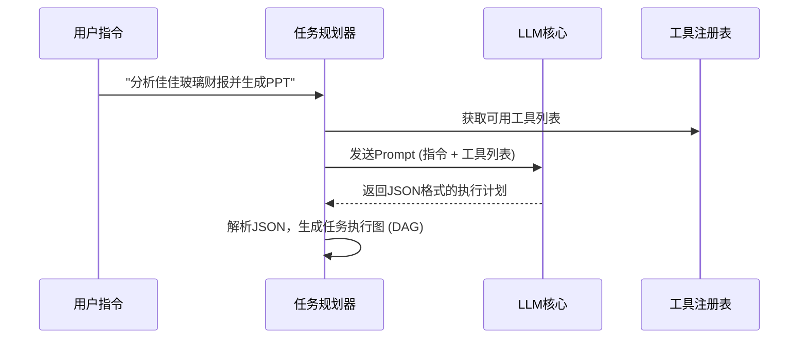

# 企业级AI原生协同平台 产品需求文档 (PRD) - V2.0

**文档状态**: 撰写中  
**版本**: 2.0.6  
**日期**: 2026年1月26日  
**撰写人**: Manus AI

---

## 第六部分：Agent OS底座详细设计

Agent OS是整个协同平台的“执行大脑”，它赋予了智伴理解复杂指令、进行任务规划、调用工具并完成工作的能力。本设计基于Anthropic最新的**Claude Agent SDK** [1]，并结合我们的业务场景进行了扩展和定制，旨在构建一个强大、可靠且可扩展的AI执行核心。

### 6.1. 核心架构与设计原则

Agent OS的架构遵循模块化和分层设计的原则，确保其核心组件可以独立升级和替换。

**核心设计原则**:

1.  **LLM无关性**: 核心逻辑与具体的大语言模型解耦。通过统一的API层，可以灵活切换或同时使用不同的LLM（如Claude 3.5 Sonnet, GPT-4o），并支持模型路由策略。
2.  **工具的统一与扩展**: 所有可执行的能力（无论是内置函数、API调用还是业务Skill）都被抽象为统一的“工具（Tool）”接口。这使得Agent的能力可以被无限扩展。
3.  **强大的上下文管理**: 借鉴并扩展了Claude Agent SDK的上下文管理机制 [2]，通过滑动窗口、记忆摘要和向量检索等技术，在保证任务连贯性的同时，有效控制长上下文带来的成本和性能问题。
4.  **安全第一**: 所有工具的执行，特别是代码执行和文件访问，都必须在严格隔离的沙箱环境中进行，防止任何潜在的安全风险。
5.  **可观测性**: Agent的每一步思考（Thought）、每一个动作（Action）都必须被详细记录，形成可供审计和调试的日志，实现“白盒”Agent。

---

### 6.2. 核心模块详细设计

#### 6.2.1. 大语言模型核心 (LLM Core)

**1. 功能说明**

负责与底层的大语言模型进行交互，是Agent的推理和语言能力的来源。

**2. 功能清单**

| 编号 | 功能点 | 优先级 |
| :--- | :--- | :--- |
| 6.2.1.1 | 多LLM后端支持（Claude, OpenAI, Gemini等） | P0 |
| 6.2.1.2 | 统一的LLM API适配层 | P0 |
| 6.2.1.3 | 动态模型路由（基于成本、性能、任务类型） | P1 |
| 6.2.1.4 | 结构化Prompt模板管理 | P0 |
| 6.2.1.5 | 思维链 (Chain-of-Thought) 与ReAct模式支持 | P0 |
| 6.2.1.6 | 输出解析与格式化（如JSON强制输出） | P0 |

**3. 技术实现说明**

- **API适配层**: 实现一个`LLMProvider`接口，为每个不同的LLM（如`ClaudeProvider`, `OpenAIProvider`）编写具体的实现类。所有上层模块只与`LLMProvider`接口交互。
- **模型路由**: 可配置一个路由规则引擎。例如：简单的问答任务路由到成本较低的`claude-3-haiku-20240307`；复杂的代码生成任务路由到能力更强的`claude-3.5-sonnet-20240620`。
- **Prompt模板**: 使用Jinja2或类似的模板引擎管理Prompt。模板中应包含系统角色、上下文、工具列表、用户指令等占位符。

---

#### 6.2.2. 任务规划器 (Task Planner)

**1. 功能说明**

将用户输入的自然语言指令，分解为一系列结构化的、可执行的步骤。

**2. 用户故事**

- **作为一名Agent开发者**，我希望**Agent能自动将“帮我分析佳佳玻璃的财报，并和行业平均水平做对比，最后生成一份PPT”这样复杂的指令，分解成“1.搜索财报 -> 2.分析财报 -> 3.搜索行业数据 -> 4.对比分析 -> 5.生成PPT”这样的步骤**，以便**Agent能有序地执行任务**。

**3. 功能清单**

| 编号 | 功能点 | 优先级 |
| :--- | :--- | :--- |
| 6.2.2.1 | 基于LLM的单步任务规划 | P0 |
| 6.2.2.2 | 多步任务的依赖关系分析 | P1 |
| 6.2.2.3 | 任务执行图（DAG）生成 | P1 |
| 6.2.2.4 | 规划的动态调整与重规划（Re-planning） | P1 |
| 6.2.2.5 | 失败任务的自动重试与错误恢复策略 | P0 |

**4. 交互流程 (内部)**

**5. 技术实现说明**

- 执行计划的生成严重依赖LLM的Function Calling或Tool Use能力 [3]。Prompt中必须清晰地描述每个工具的功能、输入和输出。
- 对于复杂的、长期的任务，一次性生成完整的执行计划并不可行。应采用**ReAct (Reason + Act)**模式，让Agent每一步都进行思考，并根据上一步的结果动态决定下一步的行动。

---

#### 6.2.3. 工具执行器 (Tool Executor)

**1. 功能说明**

负责实际调用任务规划器指定的工具，并处理其返回结果。

**2. 功能清单**

| 编号 | 功能点 | 优先级 |
| :--- | :--- | :--- |
| 6.2.3.1 | 根据工具名称动态调用 | P0 |
| 6.2.3.2 | 输入参数的自动填充与校验 | P0 |
| 6.2.3.3 | 同步与异步工具执行 | P1 |
| 6.2.3.4 | 工具执行结果的解析与标准化 | P0 |
| 6.2.3.5 | 工具执行的超时与熔断机制 | P1 |

**3. 技术实现说明**

- 实现一个`Tool`基类，所有工具都继承自该类，并实现`execute`方法。
- 工具执行器维护一个工具注册表（一个字典），`key`是工具名称，`value`是工具类的实例。
- 当LLM决定调用某个工具时（如`{"tool_name": "search_web", "parameters": {"query": "佳佳玻璃财报"}}`），执行器从注册表中找到对应的工具实例，并调用其`execute`方法。
- 对于需要执行代码的工具，必须通过沙箱环境进行调用。

---

#### 6.2.4. 沙箱环境 (Sandbox Environment)

**1. 功能说明**

提供一个安全、隔离的环境，用于执行不可信的代码或访问外部资源。

**2. 功能清单**

| 编号 | 功能点 | 优先级 |
| :--- | :--- | :--- |
| 6.2.4.1 | 基于Docker的隔离环境 | P0 |
| 6.2.4.2 | Python/JavaScript代码执行器 | P0 |
| 6.2.4.3 | 受限的文件系统访问（只读/读写指定目录） | P0 |
| 6.2.4.4 | 受限的网络访问（白名单机制） | P1 |
| 6.2.4.5 | 资源限制（CPU、内存、执行时间） | P1 |

**3. 技术实现说明**

- 可以使用`Firecracker`或`gVisor`等更轻量级的虚拟化技术来代替Docker，以降低冷启动时间和资源消耗。
- 代码执行器需捕获所有标准输出、标准错误和异常，并将其作为工具的执行结果返回。
- 文件系统访问应通过挂载特定的卷来实现，而不是直接暴露宿主机的文件系统。

---

#### 6.2.5. 上下文管理器 (Context Manager)

**1. 功能说明**

负责为LLM构建和维护一个最优的上下文窗口，这是Agent性能和成本的关键。

**2. 功能清单**

| 编号 | 功能点 | 优先级 |
| :--- | :--- | :--- |
| 6.2.5.1 | 对话历史的滑动窗口管理 | P0 |
| 6.2.5.2 | 长期记忆的向量检索与注入 | P1 |
| 6.2.5.3 | 上下文自动摘要与压缩 | P1 |
| 6.2.5.4 | Token数量监控与截断策略 | P0 |
| 6.2.5.5 | “初始化Agent”模式 [4] | P2 |

**3. 技术实现说明**

- **滑动窗口**: 简单地保留最近的N轮对话。
- **向量检索**: 将用户的每一条指令和历史对话的摘要进行向量化，当需要构建上下文时，从记忆库（见4.6节）中检索最相关的K条历史记忆，并注入到Prompt中。
- **上下文压缩**: 当上下文长度超过阈值时，使用一个专门的LLM调用来对最不重要的部分（如早期的对话）进行总结，用简短的摘要替换原始内容。
- **初始化Agent模式**: 对于需要处理大量代码或文档的超长上下文任务，可以借鉴Anthropic提出的方法，先用一个“初始化Agent”对整个上下文进行预处理，生成一个结构化的摘要或索引，后续的Agent则基于这个摘要进行工作，从而绕过单次上下文窗口的限制。

---

### 6.3. 参考文献

[1] Anthropic. (2025, September 29). *Building agents with the Claude Agent SDK*. Anthropic. https://www.anthropic.com/engineering/building-agents-with-the-claude-agent-sdk

[2] Anthropic. *Agent SDK overview*. Claude API Docs. https://platform.claude.com/docs/en/agent-sdk/overview

[3] Anthropic. *Tool use with Claude*. Claude API Docs. https://platform.claude.com/docs/en/agents-and-tools/tool-use/overview

[4] Anthropic. (2025, November 26). *Effective harnesses for long-running agents*. Anthropic. https://www.anthropic.com/engineering/effective-harnesses-for-long-running-agents

---

**（第六部分结束）**
