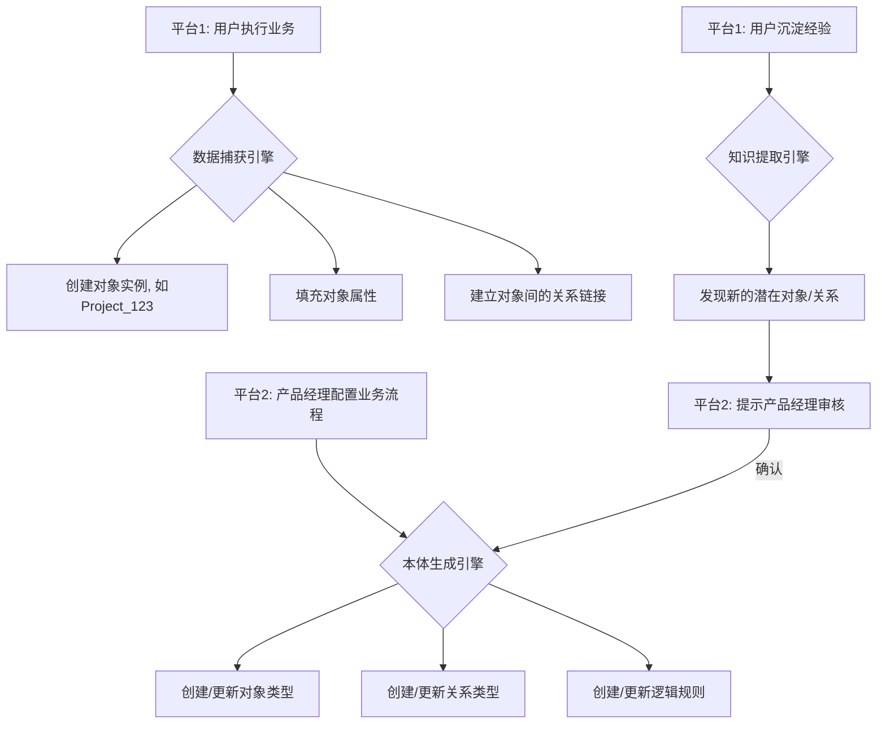

# 企业级AI原生协同平台 产品需求文档 (PRD) - V2.0

**文档状态**: 撰写中  
**版本**: 2.0.7  
**日期**: 2026年1月26日  
**撰写人**: Manus AI

---

## 第七部分：本体数据底座详细设计

本体数据底座是企业知识和经验的“结构化沉淀池”，它将非结构化的业务活动（对话、文档、流程）转化为结构化的、机器可理解的知识图谱。本设计深度借鉴了Palantir的本体论思想 [1]，并结合AI Agent的需求，构建了一个“数据-逻辑-行动”三位一体的知识表示框架。

### 7.1. 核心架构与设计原则

本体数据底座的核心是将真实世界的业务概念（如“客户”、“方案”、“风险”）及其关系，映射为数字世界的对象（Objects）、属性（Properties）和链接（Links）。

**核心设计原则**:

1.  **业务驱动建模**: 本体模型必须直接反映业务流程。不是由技术人员定义数据模型，而是由平台2的业务专家通过配置业务流程来**自动生成**本体结构。
2.  **语义化与结构化并存**: 底座同时存储原始的非结构化数据（如对话记录）和结构化的本体数据（知识图谱），并通过链接关联两者，确保信息的可追溯性和完整性。
3.  **动态演进**: 本体不是静态的，它会随着业务的进行和经验的沉淀而不断丰富和演进。新的对象类型、属性和关系可以被动态地添加到模型中。
4.  **服务于AI**: 本体设计的最终目的是服务于AI Agent。它为Agent提供了关于“世界是如何运作的”的先验知识，使其能够进行更深层次的推理和规划。

---

### 7.2. 核心模型详细设计

本体模型由五大核心元素构成：**对象 (Objects)**, **属性 (Properties)**, **关系 (Links)**, **逻辑 (Logic)**, 和 **行动 (Actions)**。

#### 7.2.1. 对象 (Objects)

**1. 功能说明**

对象是业务世界中核心实体的数字孪生。每个对象都代表一个具体的人、事、物。

**2. 核心对象类型示例**

| 对象类型 | 描述 | 示例 |
| :--- | :--- | :--- |
| `Customer` | 客户 | 佳佳玻璃 |
| `Project` | 项目 | 佳佳玻璃节能改造项目 |
| `User` | 用户 | 张三（客户代表） |
| `Solution` | 解决方案 | 玻璃熔炉余热回收方案 |
| `Risk` | 风险 | 施工周期延误风险 |
| `Document` | 文档 | 佳佳玻璃需求分析报告.docx |
| `Skill` | 技能 | 玻璃行业需求洞察Skill |
| `Tool` | 工具 | 联网搜索工具 |

**3. 技术实现说明**

- 每个对象类型在后台对应一张数据库表（如`customers`表）。
- 每个具体的对象实例对应表中的一行数据。
- 对象支持继承关系。例如，可以有一个`Person`基类，`User`和`Contact`（客户联系人）都继承自`Person`。

---

#### 7.2.2. 属性 (Properties)

**1. 功能说明**

属性是描述对象特征的数据字段。

**2. 属性示例**

- **`Customer`对象**: `name`, `industry`, `scale`, `address`, `credit_rating`。
- **`Project`对象**: `project_name`, `status`, `start_date`, `budget`, `owner_id`。
- **`Risk`对象**: `risk_description`, `probability`, `impact`, `mitigation_plan`。

**3. 技术实现说明**

- 属性在数据库中表现为表的列。
- 属性支持多种数据类型：`String`, `Number`, `Date`, `Boolean`, `Enum`, `JSON`等。
- 属性可以被标记为“必需”、“唯一”或“只读”。

---

#### 7.2.3. 关系 (Links)

**1. 功能说明**

关系定义了对象之间的连接方式，是构建知识图谱的关键。

**2. 关系类型示例**

| 关系类型 | 描述 | 基数 | 示例 |
| :--- | :--- | :--- | :--- |
| `Project` **HAS_CUSTOMER** `Customer` | 项目属于哪个客户 | N:1 | 佳佳玻璃项目 → 佳佳玻璃 |
| `Project` **HAS_MEMBER** `User` | 项目有哪些成员 | N:M | 佳佳玻璃项目 → 张三, 李四 |
| `Solution` **ADDRESSES** `Risk` | 方案解决了哪些风险 | N:M | 余热回收方案 → 能源成本过高风险 |
| `User` **OWNS** `Document` | 用户拥有哪些文档 | 1:N | 张三 → 需求分析报告.docx |
| `Skill` **USES** `Tool` | 技能使用了哪些工具 | N:M | 需求洞察Skill → 联网搜索工具 |

**3. 技术实现说明**

- 在关系型数据库中，N:1关系通过外键实现；N:M关系通过中间表（链接表）实现。
- 在图数据库（如Neo4j）中，关系是“一等公民”，可以直接表示为图中的边。
- 关系本身也可以有属性。例如，`HAS_MEMBER`关系可以有一个`role`属性（如“项目经理”）。

---

#### 7.2.4. 逻辑 (Logic)

**1. 功能说明**

逻辑定义了基于对象属性和关系的业务规则、计算和约束。

**2. 逻辑示例**

- **风险等级计算**: `Risk.level` = `Risk.probability` * `Risk.impact`。如果`level` > 0.5，则标记为“高危风险”。
- **项目状态自动更新**: 如果一个`Project`下的所有`Task`都标记为“完成”，则自动将`Project.status`更新为“已完成”。
- **预算超支警告**: 如果`Project.actual_cost` > `Project.budget` * 1.1，则触发一个“预算超支”的通知。

**3. 技术实现说明**

- 逻辑可以通过多种方式实现：
  - **数据库触发器**: 用于简单的、同表内的逻辑。
  - **后台任务/定时脚本**: 用于跨表、跨对象的复杂计算。
  - **规则引擎 (如Drools)**: 用于管理大量复杂的业务规则。
- 平台2应提供一个低代码的规则编辑器，让业务专家可以通过“IF...THEN...”的方式定义业务逻辑。

---

#### 7.2.5. 行动 (Actions)

**1. 功能说明**

行动定义了用户或AI可以对一个对象执行的操作。它将数据（本体）与行为（Agent）连接起来。

**2. 行动示例**

- **`Project`对象**: `archiveProject()`, `addMember(userId)`, `updateStatus(newStatus)`。
- **`Customer`对象**: `runCreditCheck()`。
- **`Solution`对象**: `submitForApproval()`。
- **`Risk`对象**: `escalate()`。

**3. 技术实现说明**

- 每个行动在后台对应一个函数或API端点。
- 行动是Agent OS中“工具”的面向对象封装。当Agent决定对一个对象执行某个行动时，Agent OS会调用与该行动绑定的工具。
- 例如，Agent决定执行`Customer.runCreditCheck()`，Agent OS会查找并调用名为`run_credit_check`的工具，并将`Customer`对象的ID作为参数传入。
- 在平台2的业务流程编排器中，产品经理可以将“行动”作为流程节点的一部分进行配置。

---

### 7.3. 本体生成与演进

**1. 功能说明**

定义本体如何从业务配置中自动生成，以及如何在后续的业务活动中持续演进。

**2. 功能清单**

| 编号 | 功能点 | 优先级 |
| :--- | :--- | :--- |
| 7.3.1 | 从平台2的业务流程配置自动生成本体结构 | P1 |
| 7.3.2 | 在平台1的业务执行中自动创建对象实例 | P0 |
| 7.3.3 | 从平台1的经验沉淀中提取新的对象/关系类型 | P2 |
| 7.3.4 | 本体版本控制与迁移 | P2 |

**3. 交互流程 (内部)**

**4. 技术实现说明**

- **本体生成引擎**: 一个后台服务，监听平台2配置的变更。当一个业务流程被保存时，该引擎会解析流程定义，并将其转换为对本体模型的DDL操作（如`CREATE TABLE`, `ADD COLUMN`）。
- **知识提取引擎**: 使用LLM的强大理解能力，分析用户沉淀的经验文本。例如，如果多个用户在经验中提到“交付里程碑”，引擎可能会识别出这是一个新的、重要的业务概念，并向平台2的产品经理建议创建一个新的`Milestone`对象类型。

---

### 7.4. 参考文献

[1] Palantir. (n.d.). *The Palantir Ontology*. https://www.palantir.com/platforms/foundry/ontology/

---

**（第七部分结束）**
